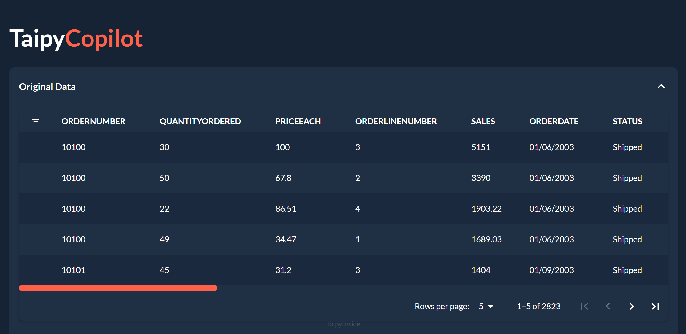
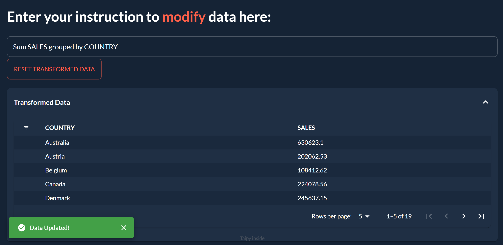
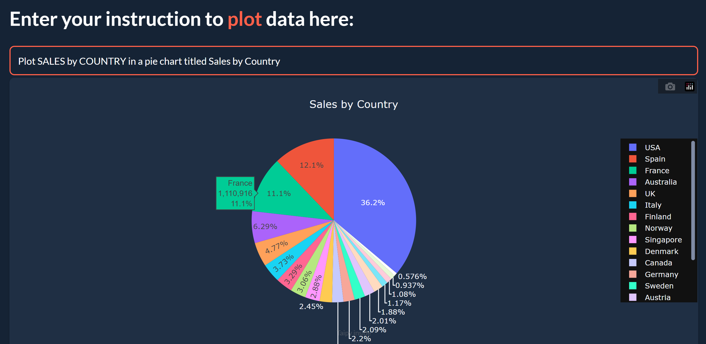

# TaipyCopilot

**Manipulate and visualize data with only natural language prompts.**

<p align="center">
  
</p>

## Usage:

TaipyCopilot works with few-shot learning on the open-source StarCoder model.

Using the App works in three steps:

**1.** The App will show you the sample dataset you are working with

<p align="center">
  
</p>

**2.** You can enter instructions to modify this data (e.g. "Sum SALES grouped by COUNTRY")

<p align="center">
  
</p>

  This will modify the data and show you the result

  You can keep entering prompts to further modify the data and you can also reset the data using the "Reset" button

**3.** You can enter instructions to visualize the data (e.g. "Plot a pie chart of SALES by COUNTRY")

<p align="center">
  
</p>

  This will plot the transformed data according to your instructions

## Known Issues

- When a prompt results in incorrect code, the app will show an error message and get stuck. To fix this, simply re-prompt and refresh the page.
- A too long prompt will cause StarCoder to repeat unfinished code which will cause a syntax error

## Setup

**Requires a Hugging Face API key in `app.py`** 

[How to get your Hugging Face API key](https://huggingface.co/docs/hub/security-tokens#:~:text=To%20create%20an%20access%20token,you're%20ready%20to%20go!)

**1.** Clone the repo

```bash	
git clone https://github.com/AlexandreSajus/TaipyLLM.git
```

**2.** Install requirements

```bash
pip install -r requirements.txt
```

**3.** Create a `secret.txt` text file next to `app.py` with your Hugging Face API key in it

**4.** Run `app.py`

```bash
python app.py
```